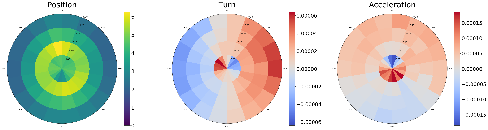
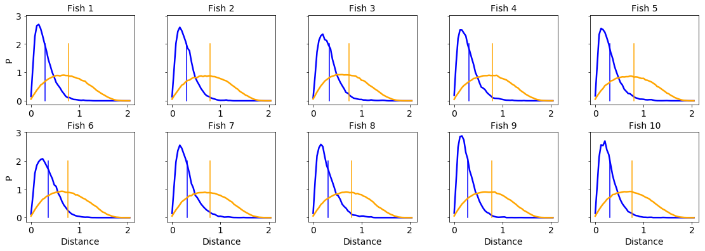

Data analysis
=============

While idtracker.ai's job ends when the trajectory files are validated. There are some extra tools (not part of but compatible with idtracker.ai), :ref:`trajectorytools` and :ref:`fish midline`.

Trajectorytools
---------------

A Python package that performs basic trajectory analysis and it is available at https://gitlab.com/polavieja_lab/trajectorytools.

You can find some analysis routines from [1]_ implemented with *trajectorytools* in https://gitlab.com/polavieja_lab/idtrackerai_notebooks. Here we present some of the analysis we get using a 10 juvenile fish video:

.. image:: ../_static/ipynb/trajectories.png
    :height: 300
    :align: left
    :alt: Plot of the trajectories of zebrafish tracked with idtracker.ai

.. image:: ../_static/ipynb/density_of_neighbours.png
    :height: 300
    :align: right
    :alt: Neighbors density plot of zebrafish tracked with idtracker.ai

.. div:: sd-text-center

    Smoothed trajectories (left) and density of neighbors around a focal fish (right)

.. figure:: ../_static/ipynb/velocity_and_acceleration.png
    :align: center
    :width: 80%

    Velocities and accelerations

    Polar distributions of positions, turnings and accelerations

    Inter-individual distance histograms compared with shuffled trajectories

Fish Midline
------------

A short Python script available at https://gitlab.com/polavieja_lab/midline to extract posture information of animals tracked with idtracker.ai. Intended to be used with fish data but easily customizable and adaptable.

.. figure:: https://gitlab.com/polavieja_lab/midline/-/raw/master/example.gif
    :width: 70%

    Example of posture information extracted with Fish Midline.

.. rubric:: References

.. [1] :external:`Hinz, R. C., & de Polavieja, G. G. (2017). Ontogeny of collective behavior reveals a simple attraction rule. Proceedings of the National Academy of Sciences, 114(9), 2295-2300. <https://doi.org/10.1073/pnas.1616926114>`
