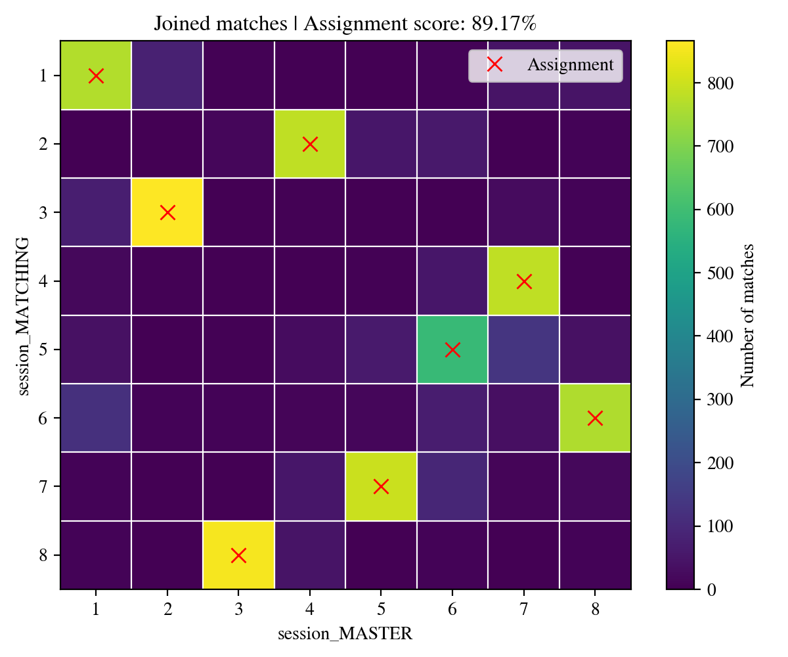

************
Idmatcher.ai
************

Idmatcher.ai is a tool included in idtracker.ai published in [1]_ that allows you to track animals through different videos. For that, you need to run idtracker.ai in each video separately and then use this tool to match their identities using the information generated by the tracking process. The best conditions for this to work well are the following:

- The sessions must have the **same identification image size**. Identification networks cannot process images whose sizes are different from the ones used during training. Check :ref:`this section <Knowledge and identity transfer>` to know how to set a fixed identification image size for all your tracking sessions.
- The sessions should have the same (or very similar) **segmentation parameters** (intensity thresholds, background subtraction...). Little differences in the identification images can make them very difficult to match.
- The sessions should come from the **same idtracker.ai version**. Different idtracker.ai versions can generate slightly different identification images making them very difficult to match.

To run idmatcher.ai, type the command above with a list of successfully tracked sessions:

.. code-block:: bash

    idmatcherai path/to/session_MASTER path/to/session_MATCHING_A path/to/session_MATCHING_B ...

Idmatcher.ai will match every session (starting from the second on the list) with the master session (the first on the list). In the example above, for example, idmatcher.ai would perform two matches, ``MATCHING_A`` with ``MASTER`` and ``MATCHING_B`` with ``MASTER``.

When matching a pair of sessions, say matching ``MATCHING`` with ``MASTER``, all the individual images from ``MATCHING`` are identified using the identification network of ``MASTER``. This creates a **direct matching matrix** where every row contains the identity predictions (according to ``MASTER``) of the images belonging to the same identity of ``MATCHING``. This matrix is saved in a *.csv* file and plotted in a *.png* image.

.. note::
    In this example, all results would be stored in ``path/to/session_MATCHING/matching_results/session_MASTER``

Then, images from ``MASTER`` are identified with the identification network of ``MATCHING`` (the other way around) generating an **indirect matching matrix**. This matrix is also saved in *.csv* and *.png* files.

Finally, both direct and indirect matching matrices are joined into a single matrix (saved in a *.csv* file and a *.png* image as the one below).

    *Joined matching matrix* example from idmatcher.ai

Every row of the joined matrix is assigned with a different column maximizing the number of matches with the :wikipedia:`Hungarian algorithm`. The assignment is saved in a ``assignments.csv`` file where identities of ``MATCHING`` (first column of the *csv*) are matched with identities of ``MASTER`` (second column). This assignment is also plotted in the *.png* files as red crosses.

Finally, the matching scores (direct and indirect) are computed for every assigned pair. A matching agreement is also computed as the ratio of matches being agree with the proposed assignment.

.. caution::
    The identification of an animal never seen by the identification network will always produce an erroneous and unpredictable result.

    That's why, when matching sessions with different number of animals, the images from the session with the higher number of animals are not taken into account during assignment. Only the images from the session with the lower number of animals are used.

    In this scenario, both direct and indirect assignment scores can be used to confirm the assignment.

.. admonition:: How are scores computed?
    :class: dropdown note

    Suppose matching ``MATCHING`` with ``MASTER``.

    Being :math:`D_{n,m}` the direct matching matrix containing the number of images with identity :math:`n` in ``MATCHING`` being identified as identity :math:`m` by ``MASTER``. And :math:`I_{n,m}` the indirect matching matrix containing the number of images with identity :math:`m` in ``MASTER`` being identified as identity :math:`n` by ``MATCHING``.

    Every identity assignment :math:`i \rightarrow j` has two associated vectors:

    - The   direct vector :math:`D_{n=i,m}` (the :math:`i_{\text{th}}`    row of the   direct matching matrix).
    - The indirect vector :math:`I_{n,m=j}` (the :math:`j_{\text{th}}` column of the indirect matching matrix).

    where both vectors have their assigned values :math:`D_{n=i,m=j}` and :math:`I_{n=i,m=j}`.

    The direct and indirect scores :math:`S` of the assignment :math:`i\rightarrow j` are computed as the normalized distance between the assigned value and the next highest value (the major competitor):

    .. math::

        S_{i\rightarrow j} = \left[
        \frac{D_{n=i,m=j}-\max{\left( D_{n=i,m\ne j}\right) }}{\max{\left( D_{n=i,m}\right) }},
        \frac{I_{n=i,m=j}-\max{\left( I_{n\ne i,m=j}\right) }}{\max{\left( I_{n,m=j}\right) }}\right]

.. rubric:: References

.. [1] :external:`Romero-Ferrero, F., Heras, F. J., Rance, D., & de Polavieja, G. G. (2023). A study of transfer of information in animal collectives using deep learning tools. Philosophical Transactions of the Royal Society B, 378(1874), 20220073. <https://doi.org/10.1098/rstb.2022.0073>`
