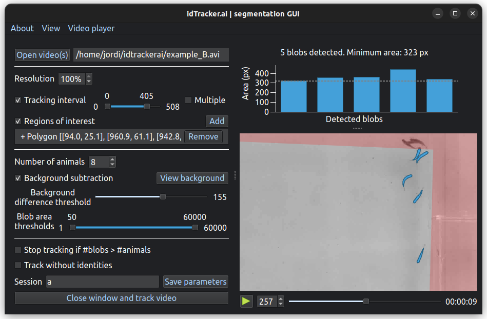
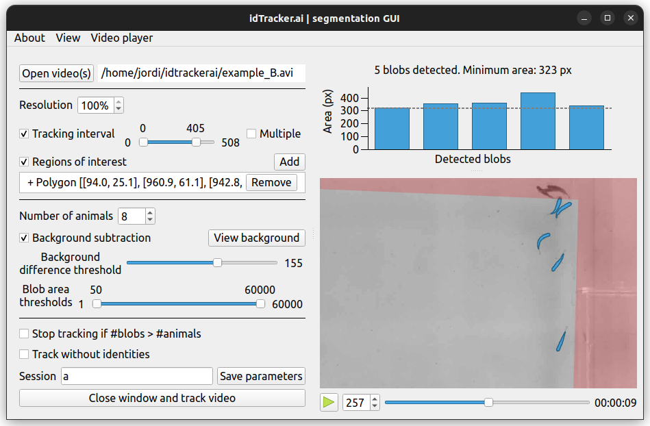

****************
Segmentation app
****************

Idtracker.ai has a graphical application to help you define the correct parameters to track your videos.

    idtracker.ai's segmentation application (in *dark* mode)

    idtracker.ai's segmentation application (in *light* mode)

In this app, the user has to find the adequate parameters to get a correct :abbr:`video segmentation (The process of partitioning the video frames distinguishing the animals from the background)`. On the left side of the app, there are the tracking parameters tools and, on the right side, the user can see the effect of these parameters in the video player and in the upper bar plot. In the video player, the detected :abbr:`blobs (General term referring to any detected object on an image)` will appear as blue polygons while their areas will be plotted in the upper figure.

.. note::
  Make sure that:

  - All animals appear as blobs when they are in frame
  - Every blob is an animal (no reflections nor external objects are detected as blobs)

  Adjust the tools in the app to get an accurate segmentation and idtracker.ai will do the rest.

Segmentation Tools
==================

Here is a detailed description of every tool in the app:

.. tip::
  The best way to learn how to use the app is to explore it. Every tool presents a *tooltip* when the cursor hovers over it, give it a try!

Open...
-------

Click *"Open..."* to browse your folders and load a video or a TOML parameters file. You can also select more than one video file to track them sequentially (intended for tracking multiple video clips of the same experiment as if they were concatenated).

Once done, if loaded a video file, the file path will appear next to the button. If multiple files were selected, they will appear in order, and you can rearrange them by drag and drop. Clicking on the video paths will set the video player to the first frame of the clicked video (useful to check continuity between videos).

Resolution reduction
--------------------

Intended for videos with very large animals (rats, mice...) where blobs get too big for a neural network to process them (>10.000 px). By decreasing this value, the video gets downscaled. Note that the output trajectories will be in full-frame resolution.

Tracking interval
-----------------

Optionally, a tracking interval can be defined (in frames units). Every frame outside the defined interval will not be processed and the trajectories there will contain :abbr:`NaN (Not a number)` values. It is also possible to define multiple tracking intervals.

Regions of interest
-------------------

To avoid undesired blobs, a :abbr:`ROI (Region of interest)` can be defined. By drawing polygons or ellipses on the video player, the user can define positive regions (where to look for blobs) or negative regions (where **NOT** to look for blobs). The negative ROIs will appear in red in the video player.

To set a region of interest:

1. Activate the tool by checking *"Regions of interest"*.
2. Click *"Add"* to start adding a new ROI.
3. Select the desired ROI style (Polygon/Ellipse, Positive/Negative).
4. Start drawing the vertices of the desired shape by clicking on the video player (left click to add points and right click to erase them).
5. Press :kbd:`Enter` (or click again *"Add"*) to finish editing the ROI.
6. Click any ROI on the list to highlight it on the video player and click *"Remove"* to eliminate it.
7. Drag and drop the existing ROIs to reorder.

When this tool is checked, the default behavior is negative, this is, if no ROI is defined the whole video area is considered a negative ROI.

Exclusive Regions of Interest
-----------------------------

.. admonition:: Experimental Feature
  :class: sidebar warning

  Exclusive ROIs is still under development and it's not guaranteed to work in all cases.

When defining more than one isolated :ref:`regions of interest`, this feature can be activated to enforce the identities to stay in a single region. During the first identity assignment (using the best global fragment), each identity will be bounded to a specific region rejecting any prediction in other regions.

This is intended for videos containing more than one isolated arenas where animals can't move from one to another.

Number of animals
-----------------

The user has to define the number of animals in the video. Some animals can be hidden in some time intervals but, for a good performance of the algorithm, there must be multiple parts in the video where all animals are visible, i.e. the number of detected blobs is equal to the specified number of animals.

Idtracker.ai is not prepared to deal with noise blobs (blobs not corresponding to an individual nor a crossing). If idtracker.ai segments a frame and it finds more blobs than animals (i.e. certainty of noise blobs presence) idtracker.ai will warn you on the :ref:`tracking log` and, if *"Stop tracking if #blobs > #animals"* is checked, it will abort the tracking process to allow the user to explore the video again and readjust the segmentation parameters ensuring an optimal tracking session.

Finally, the number of animals can be set to 0 when :ref:`track without identities`. Even so, adding the number of animals is recommended to improve the individual/crossing blob detection.

Background subtraction and intensity thresholds
-----------------------------------------------

Idtracker.ai can segment the video in two ways, with or without subtracting the background.

- **Without background subtraction**. The video is segmented using the brightness value of each pixel. Any cluster of pixels whose brightness (from 0 (black) to 255 (white)) lies between the intensity thresholds will be considered a blob. For videos where animals appear as dark blobs on a bright background, the lower intensity threshold should be at minimum. Otherwise, if animals on the video appear as bright blobs on a dark background, the upper intensity threshold should be at maximum.
- **With background subtraction**. The video is segmented using the absolute difference of brightness value between each pixel and the background. Any cluster of pixels whose absolute brightness difference with the background is greater than the *Background difference threshold* will be considered a blob.

The computed background depends on the tracking intervals and the video paths. Any modification of these two parameters will reset the computed background, so the user will have to reactivate it manually.

Area thresholds
---------------

Change the minimum and maximum area thresholds to discard undesired blobs. Only blobs with area between this range will be considered for tracking.

Stop tracking if #blobs > #animals
----------------------------------

The presence in the video of frames with more blobs than animals means a bad segmentation with non-animal blobs detected. Idtracker.ai is not built to deal with non-animal blobs (noise blobs), these can contaminate the algorithms making the identification harder. To ensure a proper segmentation, check this option and idtracker.ai will abort the tracking session if a bad segmentation is detected (this will happen when running the tracking).

Track without identities
------------------------

Check this box if you want to obtain trajectories of the animals for which the identities do not correspond to the same animal. The algorithm will skip the core of the tracking where the convolutional neural network is trained to identify the animals. Also, be aware that the algorithm also skips the interpolation step where the trajectories of the individuals in blobs belonging to multiple animals (crossings, touches...) are assigned.

If checked, the :ref:`number of animals` can be left undefined (setting it to 0). Even so, adding the number of animals is recommended to improve the individual/crossing blob detection.

Session name
------------

Type here the name of the tracking session. A folder with the name *session_[SESSION NAME]* will be created in the same folder where the video is. All the generated data from the tracking session will be saved in this folder (see :ref:`output structure`). If empty, the session name is set as a combination of the video file names.

Save parameters
---------------

Click *Save parameters* to save the tracking parameters from this app into a *.toml* file. You can use this *.toml* file to reopen the session in the future or to start tracking directly from the terminal (see :ref:`terminal usage`).

Close window and track video
----------------------------

Click to close the the app and make idtracker.ai to start the tracking process with the parameters stated in the app.

Segmentation shortcuts
======================

.. list-table::
    :widths: auto
    :header-rows: 1

    * - Key
      - Action
    * - :kbd:`Q`
      - Quit the app
    * - :kbd:`Ctrl` + :kbd:`O`
      - Open video(s) or TOML file
    * - :kbd:`Ctrl` + :kbd:`S`
      - Save parameters
    * - :kbd:`Space`
      - Play/pause video player
    * - :kbd:`1` - :kbd:`9`
      - Change the video playback speed
    * - :kbd:`Ctrl` + :kbd:`L`
      - Toggle playback framerate limit
    * - :kbd:`Right` / :kbd:`D`
      - Move video playback forward
    * - :kbd:`Left` / :kbd:`A`
      - Move video playback backward
    * - :kbd:`Enter`
      - Accept ROI when drawing
    * - :kbd:`Ctrl` + :kbd:`+`
      - Increase font size
    * - :kbd:`Ctrl` + :kbd:`-`
      - Decrease font size
