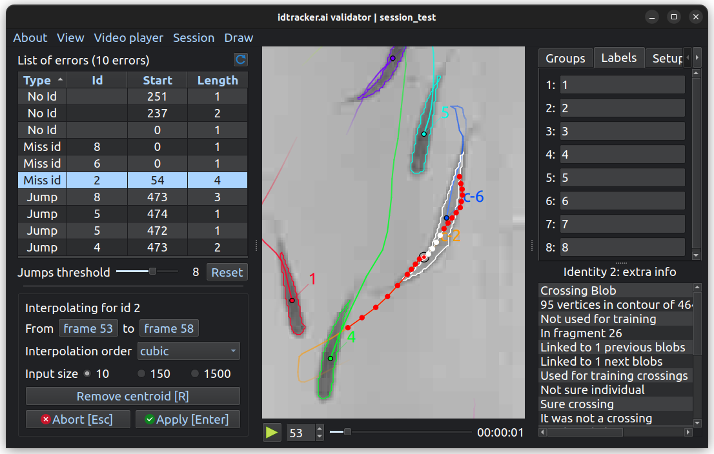
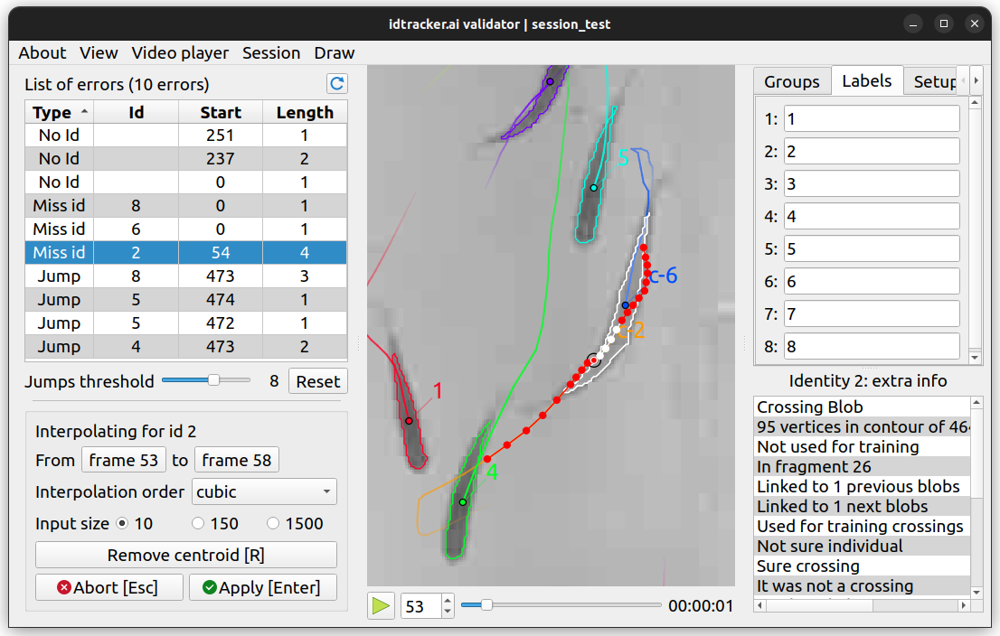

*********
Validator
*********

.. role:: toml(code)
   :language: toml

.. admonition:: Warning
    :class: sidebar warning

    This tool may be overwhelming for beginner users, there's no need to use it to get decent trajectories.

Idtracker.ai's validator is a graphical application to check, modify and validate a successful tracking session. It loads the ``list_of_blobs`` and the ``session.json`` from the session folder so setting :toml:`data_policy = 'trajectories'` would make the validator **unable** to load the session.

To start the app, run the next command:

.. code-block:: bash

    idtrackerai_validate path/to/session_folder

to open the desired session, or just

.. code-block:: bash

    idtrackerai_validate

to open a blank validator and manually opening a session by pressing :kbd:`Ctrl+O`.

    idtracker.ai's validator application (in *dark* mode)

    idtracker.ai's validator application (in *light* mode)

.. grid::
    :gutter: 0
    :class-container: sd-text-center
    :outline:
    :padding: 0

    .. grid-item::
        :padding: 2
        :columns: 12

        .. button-ref:: app_actions_link
            :color: primary
            :outline:

        Actions related to the application and its operation

    .. grid-item::
        :columns: 4

        .. grid::
            :margin: 0
            :gutter: 0
            :outline:

            .. grid-item::
                :padding: 2

                .. button-ref:: list_of_errors_link
                    :color: primary
                    :outline:

                An error analyzer and explorer

        .. grid::
            :padding: 0
            :gutter: 0

            .. grid-item::
                :padding: 2
                :columns: 12

                .. button-ref:: interpolator_link
                    :color: primary
                    :outline:

                The interpolation tool to close *NaN* gaps

    .. grid-item::
        :padding: 2
        :outline:
        :columns: 4

        .. button-ref:: video_player_link
            :color: primary
            :outline:

        The interactive video player displaying the current video frame with all extra information on top

    .. grid-item::
        :columns: 4

        .. grid::
            :margin: 0
            :gutter: 0
            :outline:

            .. grid-item::
                :padding: 2
                :columns: 12

                .. button-ref:: extra_tools_link
                    :color: primary
                    :outline:

                A collection of three minor impact tools

        .. grid::
            :gutter: 0

            .. grid-item::
                :padding: 2
                :columns: 12

                .. button-ref:: blob_extra_info_link
                    :color: primary
                    :outline:

                Displayer of selected blob's main attributes

.. _app_actions_link:

App actions
===========

Here you'll find the application options. None has an effect on the data being validated and most of them have an associated keyboard shortcut.

- **About**: contains a link to this webpage and an update checker.
- **View**: access to quit the app, change the font size and toggle the dark theme.
- **Video Player**

  - **Enable Color**: toggles color/grayscale in the video player.
  - **Limit framerate**: limits the frame rate to the framerate of the original video (default is ``True`` in the validator).
  - **Reduce memory usage**: a cache is implemented in the video player to speed up the access to previously displayed frames. The size of this cache is limited to the last 128 frames. Enable this options to reduce this to the last 16 frames and reduce RAM usage.

- **Session**

  - **Open session**: open a session by browsing the desired session folder.
  - **Reset session...**: reset all user made corrections in a specified time range or in the entire session.
  - **Save session**: save the current session as well as generating the corresponding validated trajectories file.

- **Draw**: toggle different blob's attributes to draw in the video player. Regions of interest can also be drawn when present. *Search identity* can be triggered from here.

.. _list_of_errors_link:

List of errors
==============

Contains all errors in the current session classified into four types:

- ``No id`` A blob's centroid could not be identified or has an invalid identity.
- ``Miss id`` (Missing identity) The animal with identity ``Id`` couldn't be located (*NaN* gap).
- ``Jump`` The speed of the animal with identity ``Id`` is suspiciously large.
- ``Dupl`` (Duplicated) There are more than one centroid with the same identity.

``Jump`` type errors are triggered when an animal moves faster than the mean value (of all speed values in the session) plus :math:`x` times the standard deviation. This threshold :math:`x` can be modified by the user in the *"Jumps threshold"* slider.

Clicking an error will make video player focus on it and, if the clicked error is of type ``Miss id`` or ``Jump``, the :ref:`interpolator` will activate. As some ``Jumps`` errors are not real errors, already user interpolated jumps (even if they still are over the threshold) will no longer appear as errors. User can reset the list of user accepted jumps by clicking *"Reset"*.

.. _interpolator_link:

Interpolator
============

The interpolator can correct trajectories and close *NaN* gaps by using polynomial interpolations. It activates clicking an error of type ``Miss id`` or ``Jump`` in the :ref:`list of errors` and also double clicking a centroid on the :ref:`video player` and then selecting `"Interpolate here"`.

When activated, the interpolator will focus on a single animal identity and will take some input data from the current animal trajectory (drawn as red dots in the video player) and will propose the position for the missing centroids inside the interpolation range (drawn as white dots).

User can modify the interpolation parameters (*"Interpolation order"* and *"Input size"*). Also, user can manually adjust the trajectories by:

- Removing the centroids (move through the video with :kbd:`A` and :kbd:`D` to select the centroid you want to remove and press :kbd:`R` to remove it).
- Establishing the current centroid position **right-clicking** in the video player (only when inside the interpolation range).
- Fixing wrong identifications by double-clicking on an existing centroid and assigning a new identity.

Click *"Apply"* to accept the interpolation proposal and click another errors to continue validating.

.. _video_player_link:

Video player
============

The video frames will be live displayed here as well as the blobs information (contours, labels...). Double clicking on one centroid will display the a window with some tools to modify its properties. User can change the identity of the centroid (and propagate this change up to the next crossing, it expands on the entire fragment) and also the :ref:`Interpolator` can be called from here.

.. _extra_tools_link:

Extra tools
===========

The next tools have no effect on the trajectories nor on any other aspect of the session. Their information will be included in the :ref:`trajectory files` for user to use it as desired.

Groups
------

Create identity groups by clicking *"Add"*, writing the group name, and clicking on every identity in the video player to toggle it. When done, uncheck the *"Edit"* button to finish editing the group.

Labels
------

Set a label (a name) for every identity in your session.

Setup points
------------

Create sets of *"Setup points"* by clicking *"Add"*, writing the desired name and clicking on the video player to set the desired positions of the points (left click to add a point and right click to erase it). This could be used to mark the corners/center of your experimental arena, some obstacle, or the position of a rule to calibrate distances.

Length Calibration
------------------

By clicking *"Add"*, define two points in the video and the real distance between them to calibrate the tracking. This will populate the *length_unit* property in the trajectory files to convert pixel units to the one states by the user.

Mark blobs
----------

Point out blobs based on different properties. Designed for debugging and helping to understand the tracking process. Marked blobs will appear in red.

.. _blob_extra_info_link:

Blob's extra info
=================

When clicking a centroid on the video player, this tool will display its main attributes (mostly for debugging purposes). The selected identity will be traced through the video displaying information of any blob which contains the selected identity.

Validator shortcuts
===================

.. list-table::
    :widths: auto
    :header-rows: 1

    * - Key
      - Action
    * - :kbd:`Q`
      - Quit the app
    * - :kbd:`Ctrl` + :kbd:`O`
      - Open session
    * - :kbd:`Ctrl` + :kbd:`S`
      - Save trajectories
    * - :kbd:`Alt` + :kbd:`L`
      - Toggle labels drawing
    * - :kbd:`Alt` + :kbd:`C`
      - Toggle contours drawing
    * - :kbd:`Alt` + :kbd:`P`
      - Toggle centroids drawing
    * - :kbd:`Alt` + :kbd:`B`
      - Toggle bounding boxes drawing
    * - :kbd:`Alt` + :kbd:`T`
      - Toggle trails drawing
    * - :kbd:`Alt` + :kbd:`R`
      - Toggle ROIs drawing
    * - :kbd:`Ctrl` + :kbd:`F`
      - Search identity
    * - :kbd:`Space`
      - Play/pause video player
    * - :kbd:`1` - :kbd:`9`
      - Change the video playback speed
    * - :kbd:`Ctrl` + :kbd:`L`
      - Toggle playback framerate limit
    * - :kbd:`Right` / :kbd:`D`
      - Move video playback forward
    * - :kbd:`Left` / :kbd:`A`
      - Move video playback backward
    * - :kbd:`U`
      - Update list of errors
    * - :kbd:`Ctrl` + :kbd:`A`
      - Apply interpolation (when interpolating)
    * - :kbd:`Esc`
      - Abort interpolation (when interpolating)
    * - :kbd:`R`
      - Remove current centroid (when interpolating)
    * - :kbd:`Ctrl` + :kbd:`+`
      - Increase font size
    * - :kbd:`Ctrl` + :kbd:`-`
      - Decrease font size
